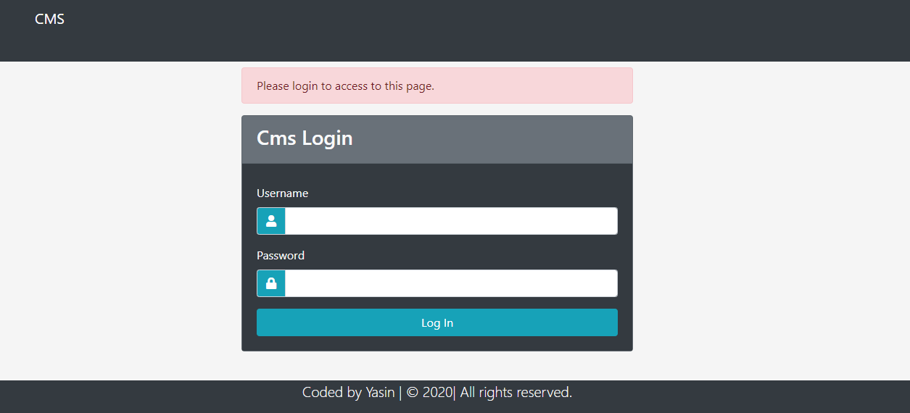
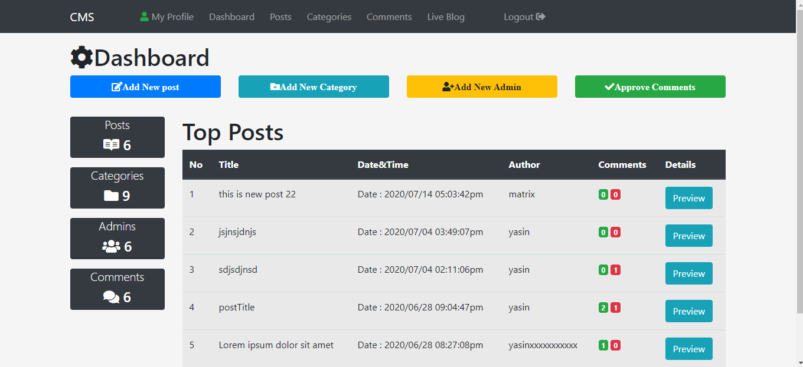
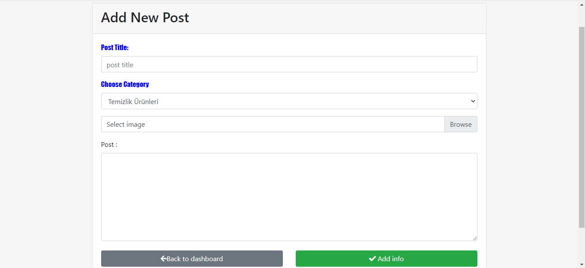
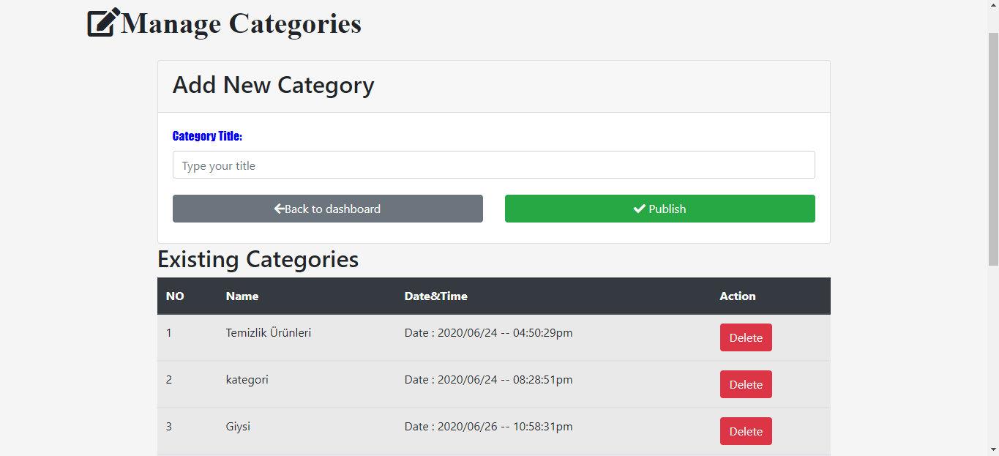
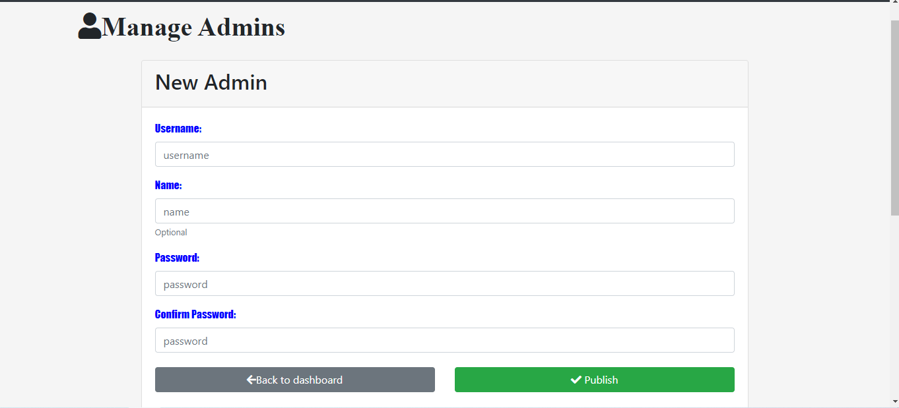
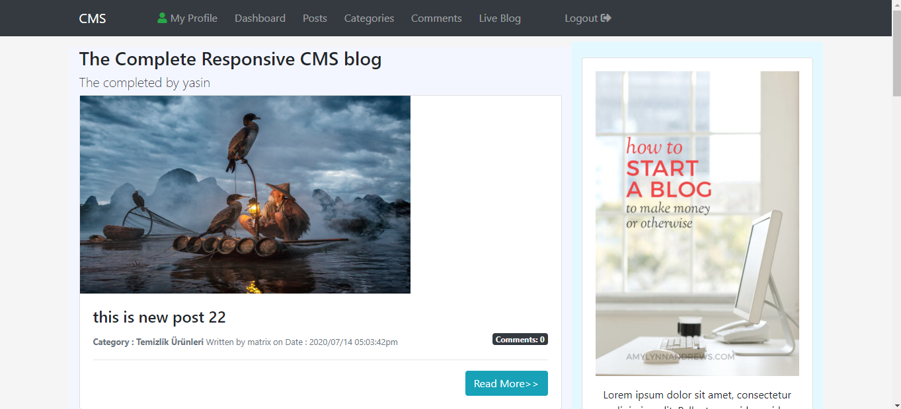
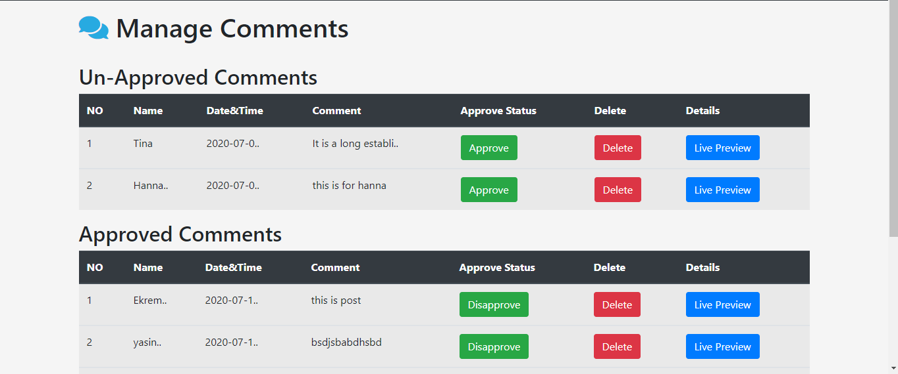
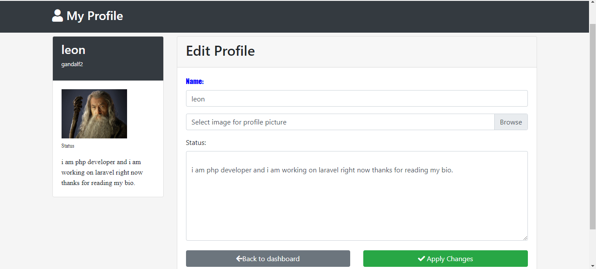

# ControlManagmentSystem

Admin panel , back-end coded with PHP and front-end coded with Bootstrap , CSS , HTML and Javascript and used MySql in database.

<b>How to run?</b>
<ol>
  <li>Go to phpMyadmin and import 'cms_system.sql' file in CMS folder.</li>
  <li>  Go to Includes/DB.php file and update db_name and password. </li>
  <li>  Run the project</li>
  <li>  For the login page use gandalf2 and 12345 for username and password.</li>
</ol>

<b>IMAGES</b> 

